# Musicwall

Een persoonlijke Electron desktop-applicatie waarmee je eigen muziek, YouTube-video's en lokale video's koppelt aan levensmomenten, georganiseerd in thematische "walls" en concertervaringen. Geïnspireerd op de Wurlitzer MediaPlayer (Flash/ActionScript, 2010–2020).

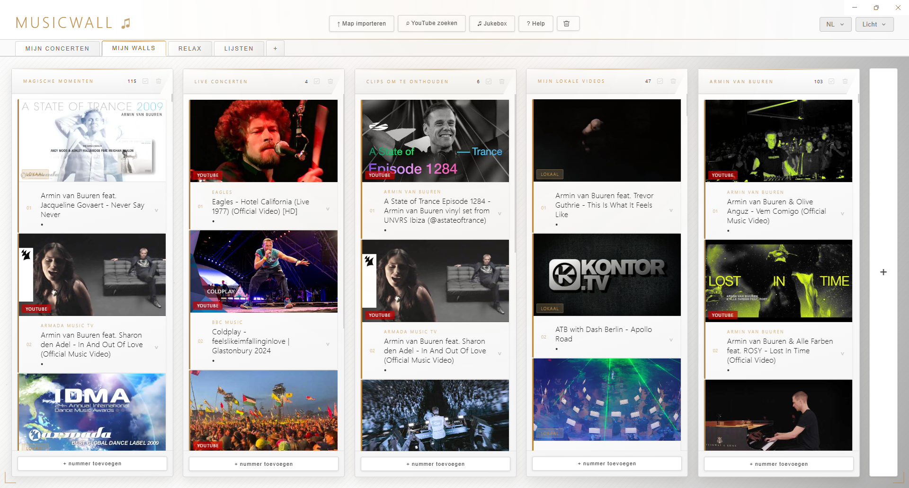

## Functionaliteit

- **Walls** — groepeer video's (YouTube of lokaal) rond een thema, met een titel, artiest en persoonlijk verhaal per nummer
- **Wall-groepen** — verdeel walls over eigen tabs (bijv. per thema of gelegenheid), aan te maken en te herordenen naast de vaste "Mijn walls"/"Mijn concerten"-tabs; alle tabs zijn te hernoemen
- **Concertervaringen** — leg concerten vast met foto's, video's en YouTube-clips in een collage, inclusief verhaal, naam en datum, met een navigeerbare volledig-scherm viewer om doorheen te bladeren
- **Jukebox** — speel je eigen playlist af, lokale muziek video's én YouTube door elkaar, met shuffle, vorige/volgende en schermvullende weergave; een YouTube-nummer dat niet afspeelbaar is wordt automatisch overgeslagen met een melding, je muziek wordt in een geanimeerde Pioneer PLX1000 platenspeler afgespeeld; playlists zijn op te slaan onder een eigen naam en later weer te laden
- **Muziek-albums** — importeer een map met mp3/m4a/flac/wav-bestanden in één keer als album; hoes, artiest en tracks worden automatisch herkend, met een eigen albumscherm om doorheen te bladeren en tracks af te spelen
- **YouTube zoeken & map importeren** — zoek video's of hele playlists (per artiest of genre) direct binnen Musicwall, of importeer een map met lokale bestanden; eerst een groepskeuze zodat je meteen de juiste wall uit de juiste groep kiest
- **Zeven thema's** — Standaard, Metaal, Jukebox, Nacht, Raw, Natuur en Licht, elk met een eigen kleurpalet en achtergrondstijl
- **Meertalig** — Nederlands/Engels, automatisch op basis van je systeemtaal, met handmatige wisselknop

## Screenshots

### Concertervaringen

Concerten vastleggen met foto's, video's en YouTube-clips, elk met een eigen verhaal en datum.

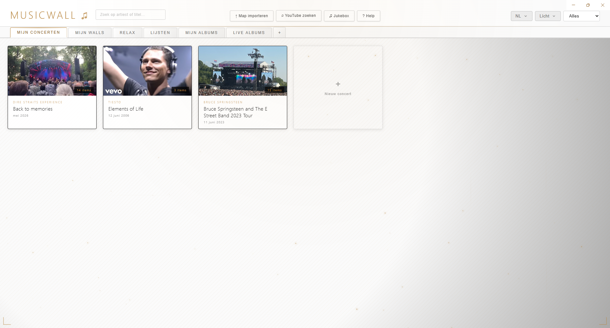
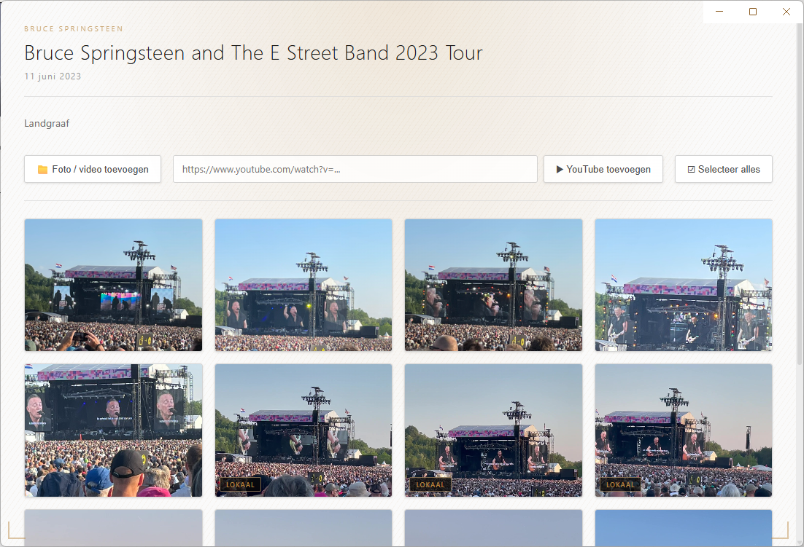

### Jukebox

Eén playlist, lokale muziek, video's en YouTube door elkaar, met een schermvullende speler. Lokale muziek speelt af in een geanimeerde platenspeler; playlists zijn op te slaan en later weer te laden.

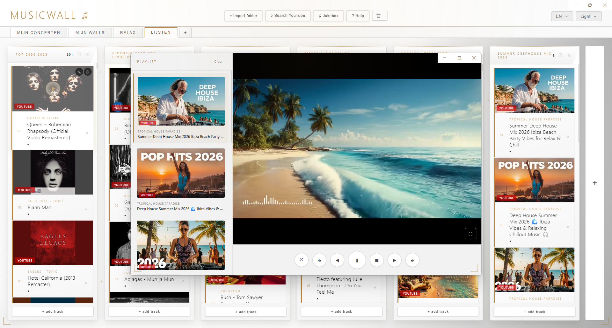
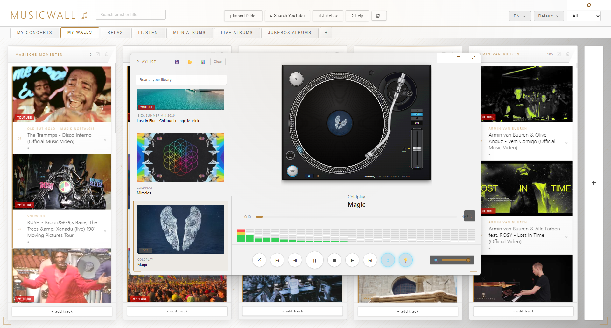
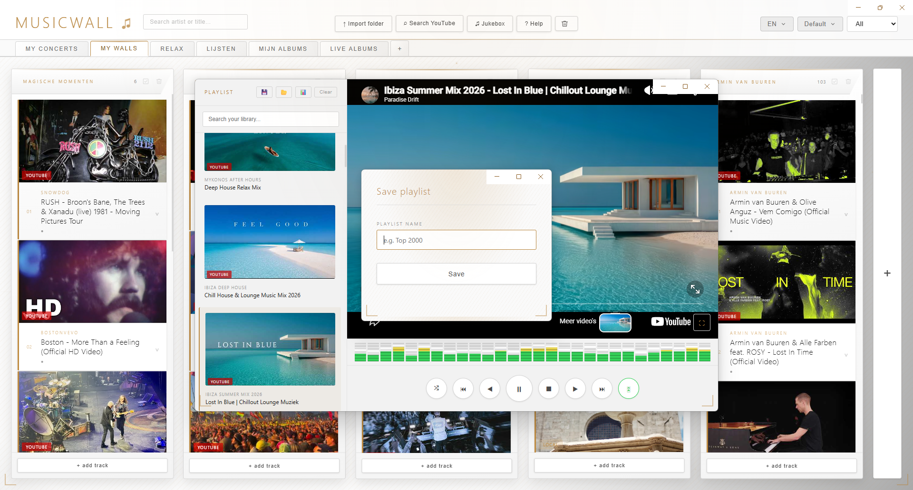
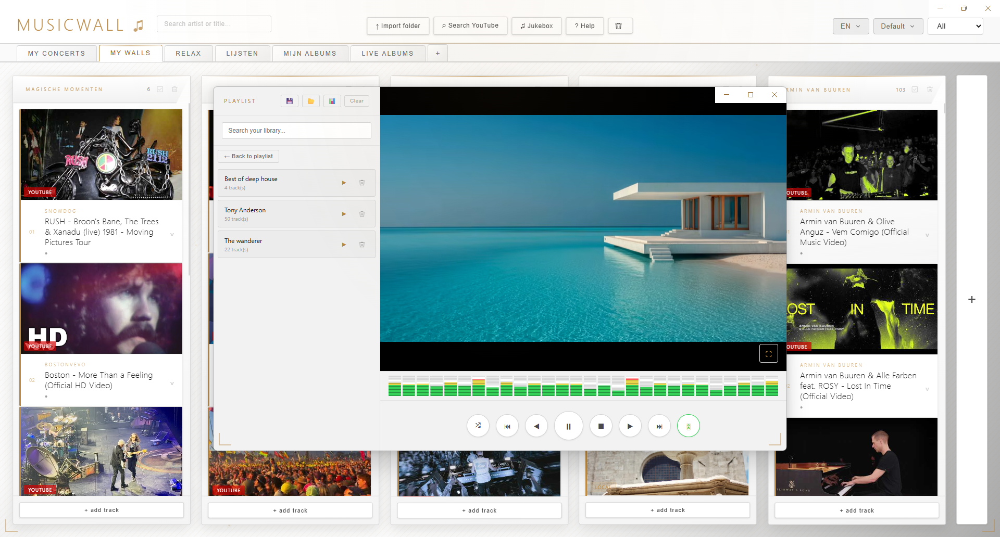

### Muziek-albums

Importeer een map met mp3/m4a/flac/wav-bestanden als album, met hoes, artiest en tracks automatisch herkend.

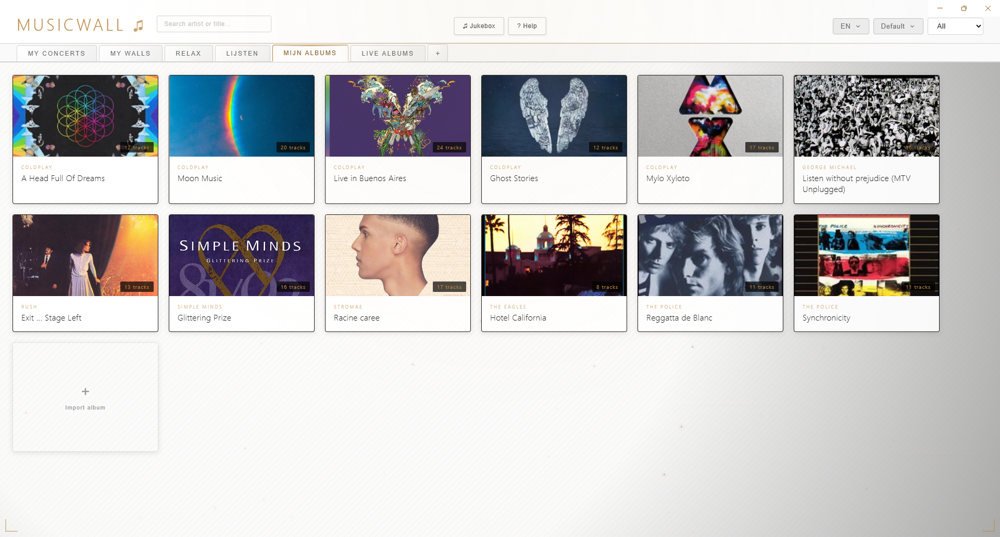
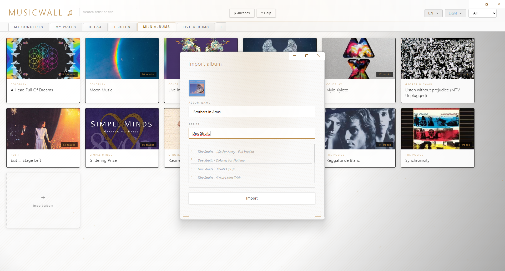
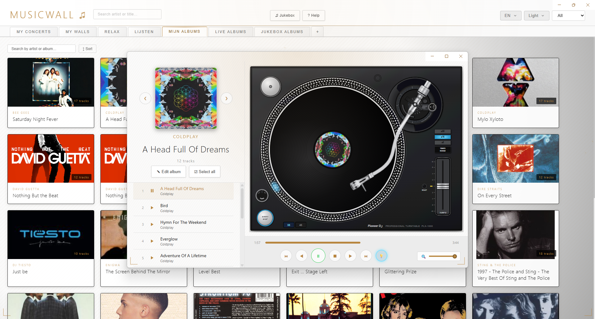

### YouTube zoeken en map importeren

Zoek direct binnen Musicwall naar video's of hele playlists, of importeer in één keer een map met lokale bestanden.

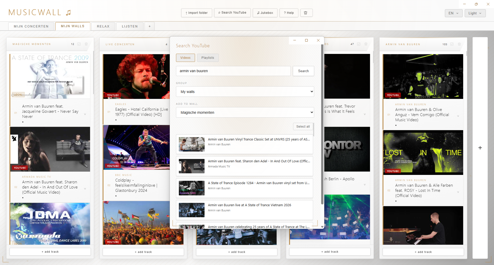
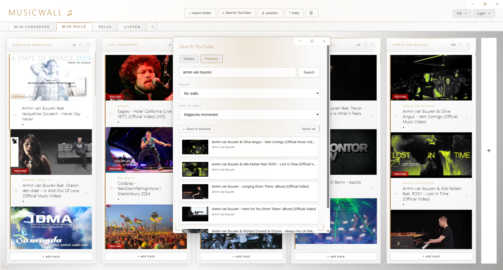
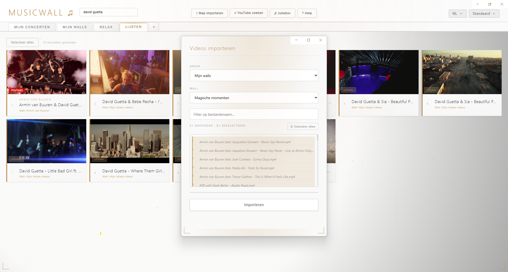

### Thema's en taal

Zeven thema's en twee talen, allebei met één klik te wisselen.

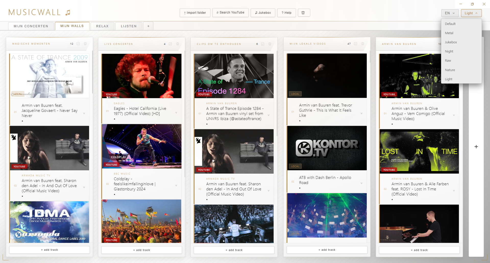
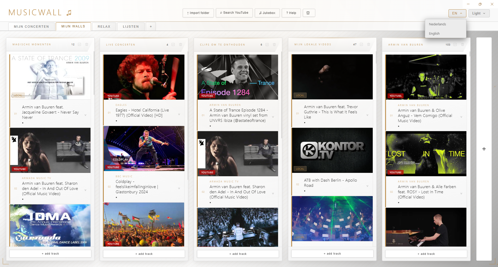
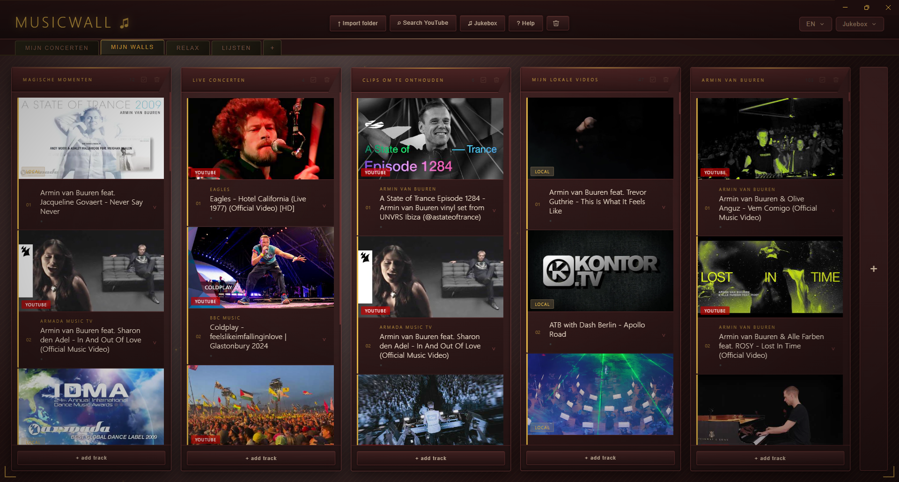

### Help

Een ingebouwd helpscherm legt elke functie uit, in de taal van de gebruiker.

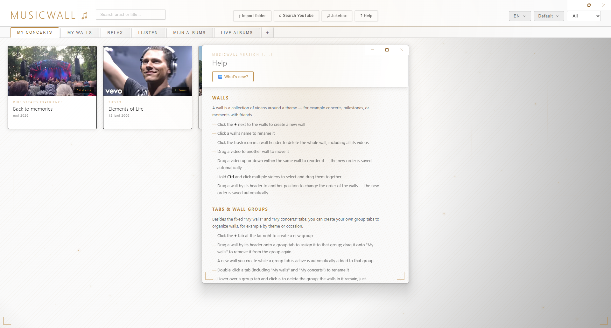

## Technische stack

- [Electron](https://www.electronjs.org/) v42
- SQLite via `better-sqlite3`
- [GSAP](https://gsap.com/) voor animaties
- `ffmpeg-static` voor thumbnail-generatie

## Installatie & ontwikkelen

```bash
npm install
npm start
```

Gebruikersdata (database en thumbnails) wordt opgeslagen in `%APPDATA%\Musicwall\`.

## Build

Een distributeerbare Windows-installer bouwen:

```bash
npm run build
```

Het resultaat komt in de map `dist/` te staan (`Musicwall Setup.exe` en een unpacked versie).

## Releases

Bij het pushen van een versietag (`vX.Y.Z`) bouwt een GitHub Actions-workflow automatisch een installer en zet die als concept-release klaar onder [Releases](https://github.com/asmraap-ship-it/musicwall/releases). Zie `CLAUDE.md` voor het volledige releaseproces.

## Licentie

Copyright © 2026 Alain Raap

Musicwall is vrije software, uitgebracht onder de [GNU General Public License v3.0 (of later)](LICENSE) — je mag de code vrij gebruiken, aanpassen en verspreiden, zolang afgeleide versies onder dezelfde licentie open source blijven.

## Projectstructuur

```
main.js               Electron main process, alle ipcMain handlers, lokale server voor de YouTube-jukebox-speler
database.js            SQLite initialisatie, tabel definities
index.html              Hoofdscherm
css/                        Stylesheets, incl. css/themas/ voor de zeven thema's
js/index.js               Walls logica, drag-and-drop, GSAP animaties
js/concerten.js         Concertervaringen logica
js/jukebox.js            Jukebox-speler (lokaal + YouTube via postMessage)
yt-embed.html          Ingesloten YouTube IFrame Player, geserveerd via een lokale http-server
js/i18n.js + js/vertalingen.js   Meertaligheid (NL/EN)
db/                          CRUD-modules per tabel (walls, wallgroepen, videos, concerten, playlist)
build/icon.ico           App-icoon
```

Zie `CLAUDE.md` voor uitgebreide projectcontext en ontwerpkeuzes.
"# musicwall-privacy" 
